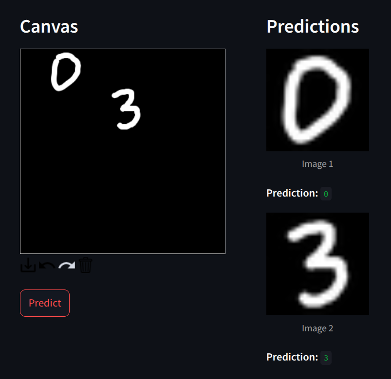
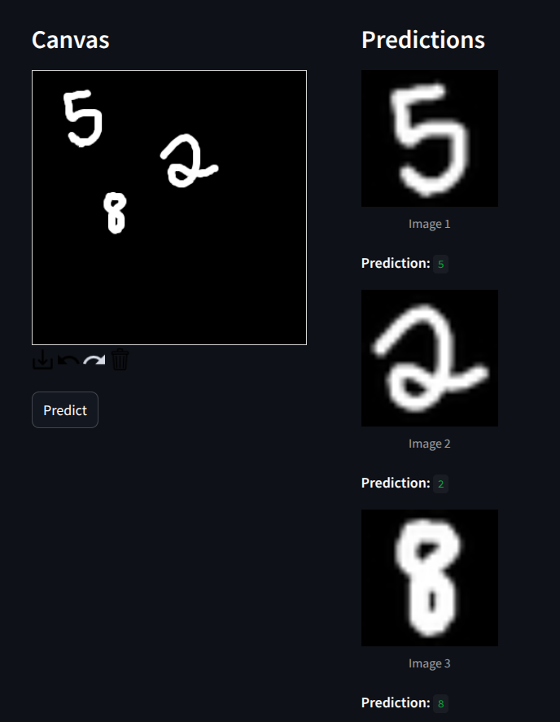

# MNIST Digit Recognizer

This is a simple Streamlit web app that lets users draw digits and predicts them using a trained Support Vector Machine (SVM) classifier on the MNIST dataset.

---

## Features

- Draw digits on an interactive canvas

- Image is automatically detected and processed

- Click `Predict` to detect and classify the drawn digit

- Prediction appears instantly beside the canvas

- Pipeline includes `StandardScaler`, `PCA`, and an `SVM` classifier

- Hyperparameters optimized using `BayesSearchCV`

- Includes [data_analysis.ipynb](./data_analysis.ipynb) for dataset exploration  

- Includes [model_analysis.ipynb](./model_analysis.ipynb) for performance analysis

---

## Sample Predictions (Test Images)

Here are a few test images and their corresponding predictions by the model:

- Sample 1



- Sample 2



---

## How to Run

1. Clone the repository:

   ```bash
   git clone https://github.com/GBhavaniShankar/mnist-magicbox
   cd mnist-magicbox
   ```

2. Install dependencies:

   ```bash
   pip install -r requirements.txt
   ```

3. Launch the app:

   ```bash
   streamlit run app.py
   ```
